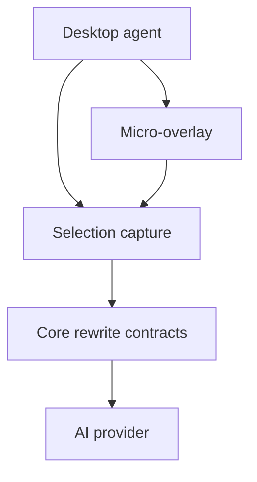

# ParaPhraser architecture

## Current vertical slice

1. `GlobalHotkeyService` registers system-wide shortcuts through `RegisterHotKey`.
2. `ClipboardSelectionService` waits for the shortcut modifiers to be released,
   preserves the clipboard, sends `Ctrl+C`, and reads the selected text.
3. `OverlayWindow` shows a one-off contextual instruction composer beside the cursor.
4. `RewriteCoordinator` sends the selection and source metadata to local Ollama.
5. The overlay shows the suggestion without saving conversation history.
6. When the user confirms, `ClipboardSelectionService` restores the original app,
   pastes the replacement, and restores the previous clipboard contents.

## Boundaries

`ParaPhraser.Core` contains no WPF or Win32 dependencies. A cloud provider,
local model, or test transformer can therefore implement `ITextTransformer`
without changing selection capture or UI code.

## Planned next slices

- A settings UI for the local Ollama model and context limit.
- Configurable shortcut settings stored per Windows user.
- UI Automation selection capture before the clipboard fallback.
- Direct replace mode with a visible undo notification.
- HTML/RTF-aware replacement for rich editors.
- Startup registration and installer/update integration.

## Security rules

- Never monitor or transmit keystrokes continuously.
- Capture text only after an explicit shortcut.
- Reject password and protected controls when UI Automation is introduced.
- Never ship a shared AI provider key inside the desktop binary.
- Avoid logging selected text or model responses by default.
